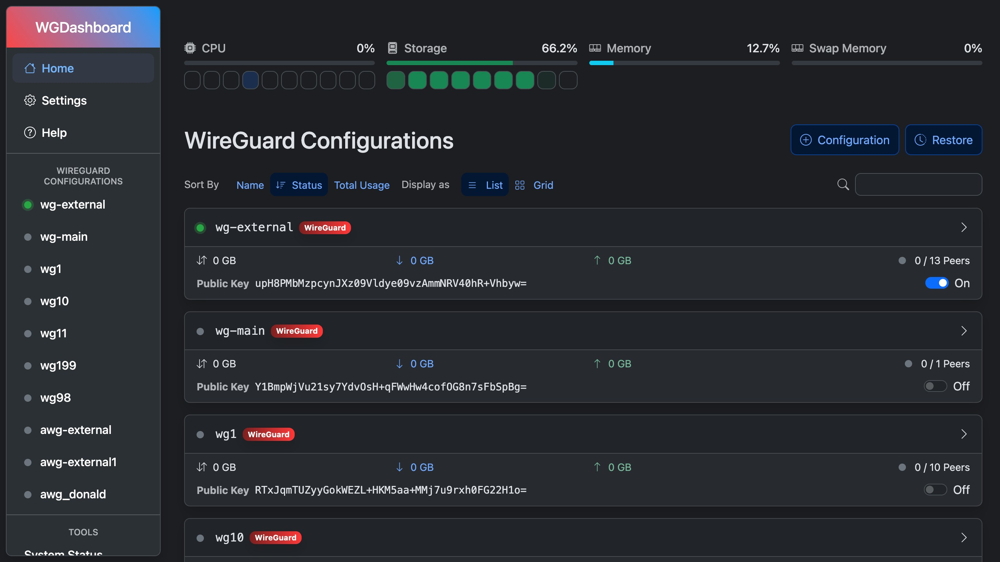

# WGDashboard for YunoHost

[](https://dash.yunohost.org/appci/app/wgdashboard)    
[](https://install-app.yunohost.org/?app=wgdashboard)

*[Lire ce readme en français.](./README_fr.md)*

> *This package allows you to install WGDashboard quickly and simply on a YunoHost server.
If you don't have YunoHost, please consult [the guide](https://yunohost.org/#/install) to learn how to install it.*

## Overview

WGDashboard is a modern web application to manage WireGuard VPN configurations. It provides an intuitive interface for creating, editing, and monitoring WireGuard configurations and peers.

### Features

- Web-based WireGuard configuration management
- Peer management with QR code generation for easy mobile setup
- Real-time connection monitoring and bandwidth tracking
- Multi-configuration support
- User-friendly interface with dark/light theme support
- Automated initial setup (no manual web configuration required)

**Shipped version:** v4.2.4~ynh1

**Demo:** https://demo.wgdashboard.dev/

## Screenshots



## Disclaimers / important information

### WireGuard Integration

This package automatically installs and configures WireGuard if not already present. It's designed to coexist peacefully with other WireGuard packages (like the dedicated `wireguard_ynh` package) using ACL-based permissions instead of conflicting ownership.

### Automated Setup

Upon installation, WGDashboard is automatically configured with:
- Uses the selected YunoHost admin user for login
- Option to provide custom password during installation, or auto-generates one
- Disabled TOTP/2FA by default (can be enabled later)
- Credentials displayed during installation and stored in app settings

### Admin Access

After installation, you can access your WGDashboard with:
- **Username:** Your selected YunoHost admin user
- **Password:** Custom password if provided, or auto-generated (shown during installation)

You can retrieve your credentials later using: `yunohost app setting wgdashboard wg_password`

* Any known limitations, constrains or stuff not working, such as (but not limited to):
    * requiring a full dedicated domain ?
    * architectures not supported ?
    * not-working single-sign on or LDAP integration ?
    * the app requires an important amount of RAM / disk / .. to install or to work properly
    * etc...

* Other infos that people should be aware of, such as:
    * any specific step to perform after installing (such as manually finishing the install, specific admin credentials, ...)
    * how to configure / administrate the application if it ain't obvious
    * upgrade process / specificities / things to be aware of ?
    * security considerations ?

## Documentation and resources

* Official app website: <https://example.com>
* Official user documentation: <https://yunohost.org/apps>
* Official admin documentation: <https://yunohost.org/packaging_apps>
* Upstream app code repository: <https://some.forge.com/example/example>
* YunoHost documentation for this app: <https://yunohost.org/app_example>
* Report a bug: <https://github.com/YunoHost-Apps/example_ynh/issues>

## Developer info

Please send your pull request to the [testing branch](https://github.com/YunoHost-Apps/example_ynh/tree/testing).

To try the testing branch, please proceed like that.

``` bash
sudo yunohost app install https://github.com/YunoHost-Apps/example_ynh/tree/testing --debug
or
sudo yunohost app upgrade example -u https://github.com/YunoHost-Apps/example_ynh/tree/testing --debug
```

**More info regarding app packaging:** <https://yunohost.org/packaging_apps>
